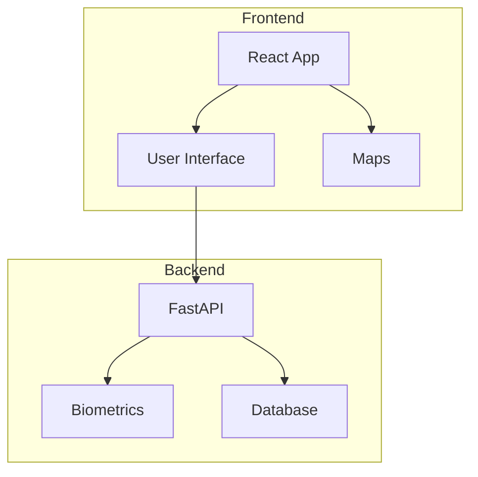
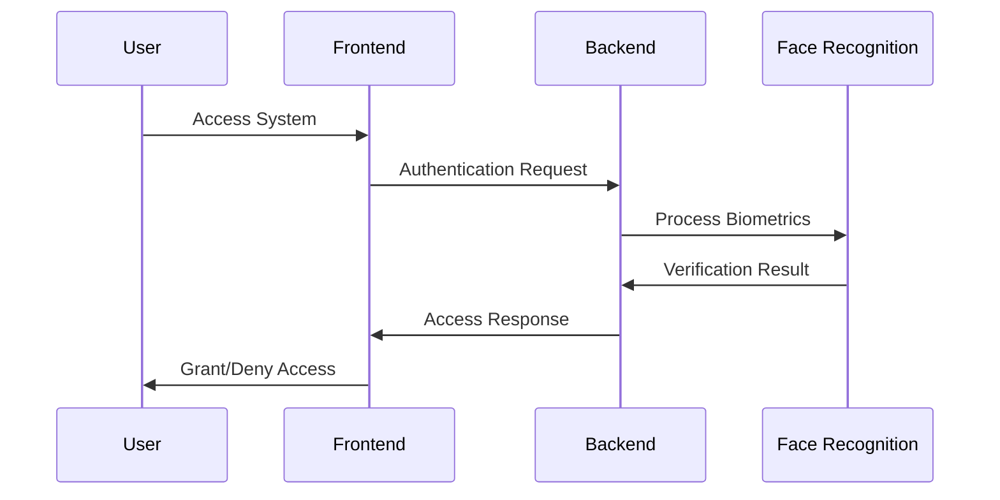
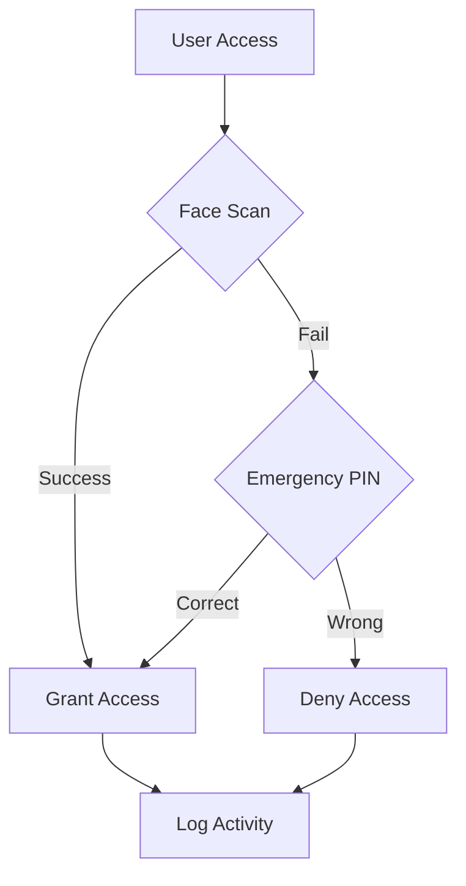
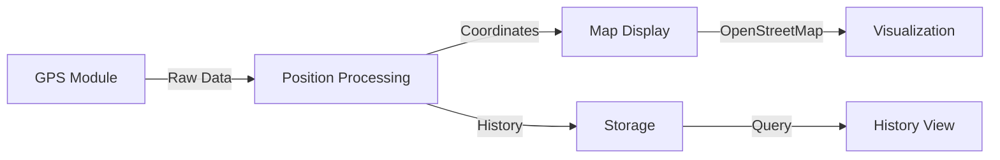

# Biometric Car Security System
## Technical Deep Dive

<div class="pt-12">
  <span class="px-2 py-1">Vehicle Security Reinvented</span>
</div>

<div class="abs-br m-6 flex gap-2">
  <a href="https://github.com/your-repo" target="_blank" alt="GitHub"
    class="text-xl icon-btn opacity-50 !border-none !hover:text-white">
    <carbon-logo-github />
  </a>
</div>

<!--
Presenter notes:
- Welcome the audience
- Set context about vehicle security challenges
- Highlight the innovative approach
-->

---
layout: two-cols
---

# System Overview

<div class="flex-col space-y-4">
<div>
  🔐 Advanced Authentication
  - Facial Recognition
  - Emergency PIN System
</div>

<div>
  📍 Real-time Tracking
  - GPS Location Monitoring
  - Journey History
</div>

<div>
  🔒 Enhanced Security
  - Encrypted Storage
  - Access Control
</div>
</div>

::right::



<!--
Presenter notes:
- Explain each core feature
- Highlight integration points
- Discuss real-world applications
-->

---
layout: default
---

# Technical Architecture

<div class="grid grid-cols-2 gap-4">

<div>
  <h3>Frontend Stack</h3>
  - React 18+ with TypeScript
  - Vite Build System
  - ShadcnUI Components
  - Leaflet Maps Integration
</div>

<div>
  <h3>Backend Stack</h3>
  - FastAPI (Python)
  - OpenCV Integration
  - Face Recognition Engine
  - Encrypted Storage System
</div>

</div>

<div class="mt-8">

</div>

<!--
Presenter notes:
- Detail the technology choices
- Explain the authentication flow
- Highlight security measures
-->

---
layout: image-right
image: 'https://source.unsplash.com/collection/94734566/1920x1080'
---

# Biometric Processing

### Face Recognition Pipeline

1. Image Capture
2. Face Detection
3. Feature Extraction
4. Template Matching
5. Decision Making

### Advanced Features

- Multiple Face Analysis
- Liveness Detection
- Anti-spoofing Measures
- Fallback Mechanisms

<!--
Presenter notes:
- Explain the biometric pipeline
- Discuss accuracy rates
- Cover security measures
-->

---
layout: two-cols
---

# Security Implementation

### Data Protection
- XOR Encryption
- Base64 Encoding
- Secure File Storage
- Access Logging

### Authentication Layers
1. Primary Biometric Auth
2. Emergency PIN System
3. Session Management
4. Rate Limiting

::right::



<!--
Presenter notes:
- Detail encryption methods
- Explain fallback systems
- Discuss security best practices
-->

---
layout: default
---

# GPS Tracking System

<div class="grid grid-cols-2 gap-4">

<div>
### Features
- Real-time Location
- Journey History
- Geofencing
- Speed Monitoring
</div>

<div>
### Implementation
- OpenStreetMap Integration
- WebSocket Updates
- Location Clustering
- Path Optimization
</div>

</div>



<!--
Presenter notes:
- Explain GPS accuracy
- Discuss privacy considerations
- Cover data retention policies
-->

---
layout: section
---

# Database Architecture

<div class="grid grid-cols-2 gap-4 mt-8">

<div>
```json
{
  "user": {
    "id": "string",
    "name": "string",
    "biometric_data": "encrypted",
    "access_level": "number",
    "vehicle_id": "string"
  }
}
```
</div>

<div>
```json
{
  "access_log": {
    "timestamp": "date",
    "user_id": "string",
    "action": "string",
    "status": "string",
    "location": "coordinates"
  }
}
```
</div>

</div>

<!--
Presenter notes:
- Explain data structure
- Discuss relationships
- Cover encryption methods
-->

---
layout: default
---

# API Endpoints

<div class="grid grid-cols-2 gap-4">

<div>
### Authentication
```typescript
POST /api/register
POST /api/verify-face
POST /api/verify-pin
GET  /api/auth/status
```
</div>

<div>
### Data Management
```typescript
GET  /api/users
GET  /api/logs
GET  /api/stats
POST /api/location/update
```
</div>

</div>

<div class="mt-8">
### Response Format
```json
{
  "status": "success|error",
  "message": "string",
  "data": {}
}
```
</div>

<!--
Presenter notes:
- Detail each endpoint
- Explain authentication
- Cover rate limiting
-->

---
layout: two-cols
---

# Development Setup

### Prerequisites
- Python 3.8+
- Node.js 16+
- OpenCV
- face_recognition

### Backend Setup
```bash
conda create -n biometric python=3.8
conda activate biometric
pip install -r requirements.txt
```

::right::

### Frontend Setup
```bash
npm install
npm run dev
```

### Running Tests
```bash
# Backend tests
pytest tests/

# Frontend tests
npm test
```

<!--
Presenter notes:
- Walk through setup steps
- Highlight common issues
- Discuss testing strategy
-->

---
layout: center
class: text-center
---

# Future Enhancements

<div class="grid grid-cols-3 gap-4 mt-8">

<div>
### Phase 1
- Multi-factor Auth
- Enhanced Analytics
- Mobile App Integration
</div>

<div>
### Phase 2
- AI-powered Detection
- Cloud Deployment
- Fleet Management
</div>

<div>
### Phase 3
- Predictive Security
- IoT Integration
- Blockchain Records
</div>

</div>

<!--
Presenter notes:
- Discuss roadmap
- Highlight priorities
- Cover timeline
-->

---
layout: end
---

# Thank You

### Contact & Resources

- 📧 Technical Support: support@example.com
- 📚 Documentation: docs.example.com
- 🔧 GitHub Repository: github.com/example
- 📱 Mobile App: app.example.com

<!--
Presenter notes:
- Take questions
- Share contact info
- Provide next steps
-->