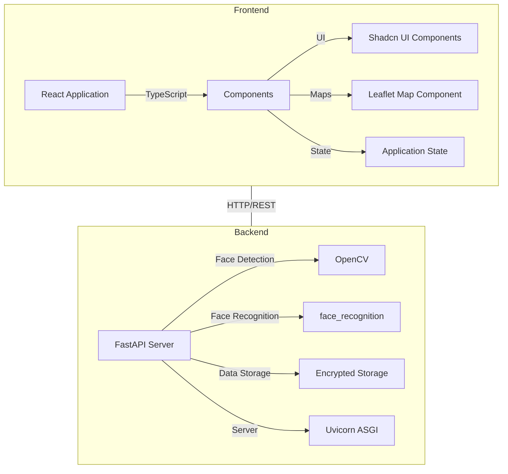
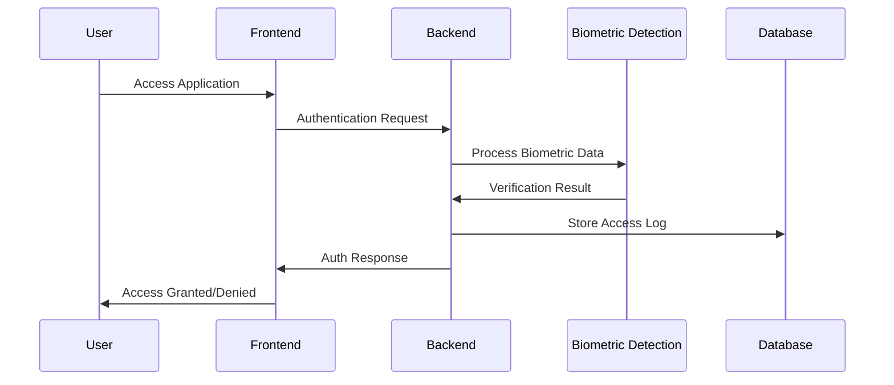
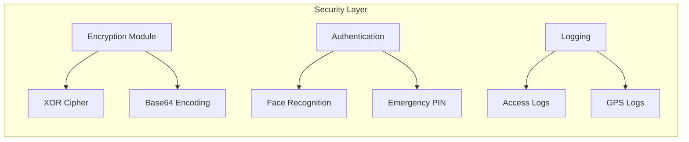
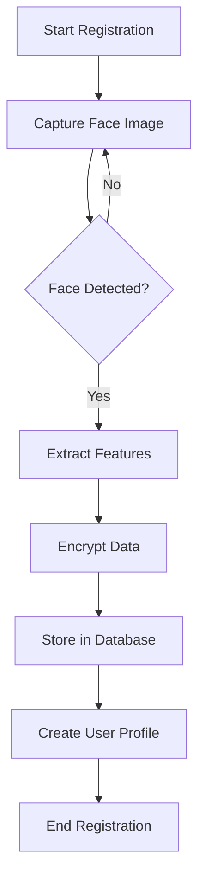
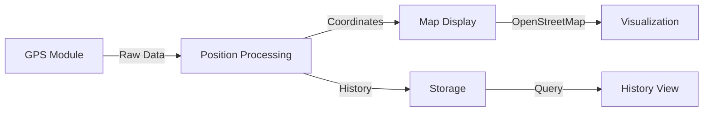

# System Architecture Diagram



# Data Flow Diagram



# Security Components



# User Registration Flow



# GPS Tracking System



# System Components Interaction

```mermaid
graph TB
    subgraph User Interface
        Login --> Dashboard
        Dashboard --> |View| History
        Dashboard --> |Track| GPS
        Dashboard --> |Manage| Settings
    end
    
    subgraph Core Services
        Auth[Authentication Service]
        Face[Face Processing]
        Store[Data Storage]
        Track[Location Tracking]
    end
    
    User Interface ---|API Calls| Core Services
```